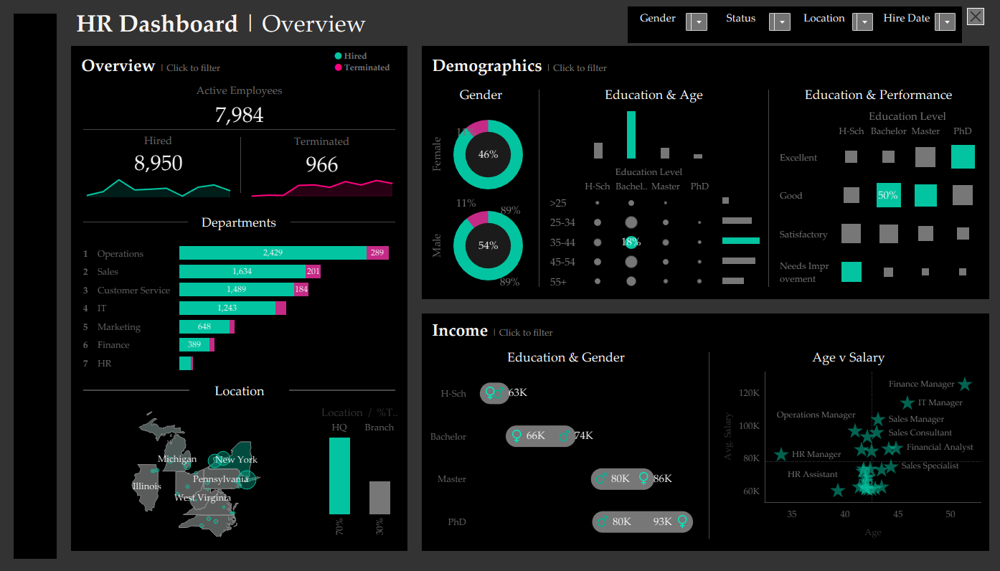

# Data-Visualization-Portfolio

# HR Analytics Dashboard

## Project Overview

This dashboard was built to track key HR metrics including employee turnover, recruitment efficiency, and performance distribution.

### Preview

### Tools Used

  Tableau Desktop: For data modeling and visualization.

  Excel: For initial data cleaning and preparation.

### How to View

You can download the .twbx file from this repository and open it using Tableau Desktop or the free Tableau Reader.
